# Full-stack blog
A full stack blog implementation with a Grafana dashboard.

  

## Screenshots
### UI
#### Laptop/Desktop
|||
|---|---|
|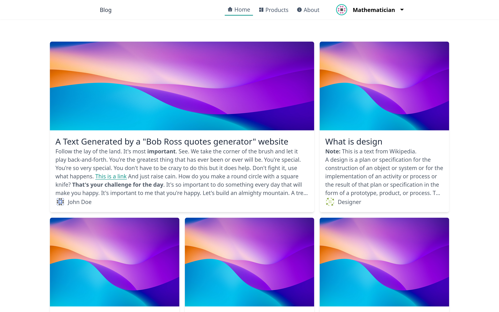|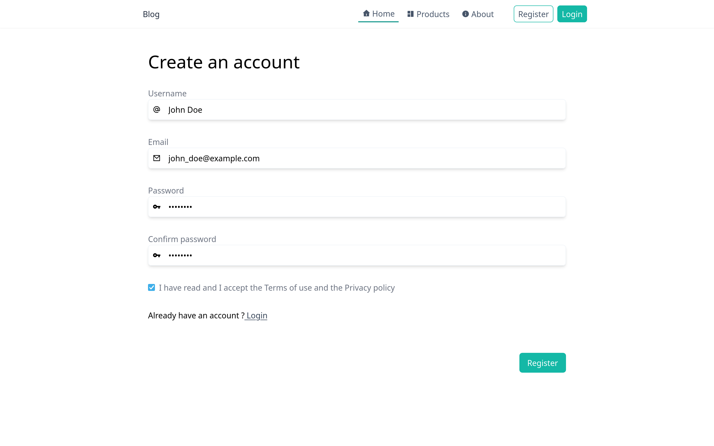|
|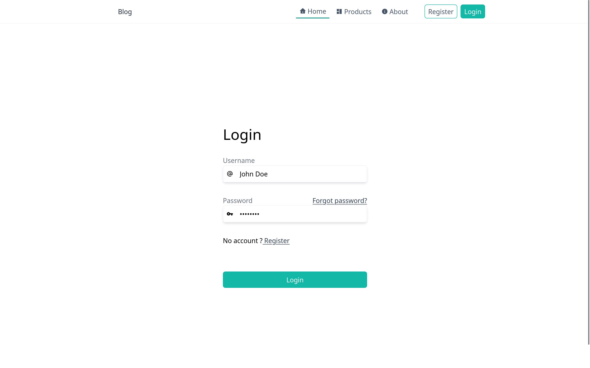|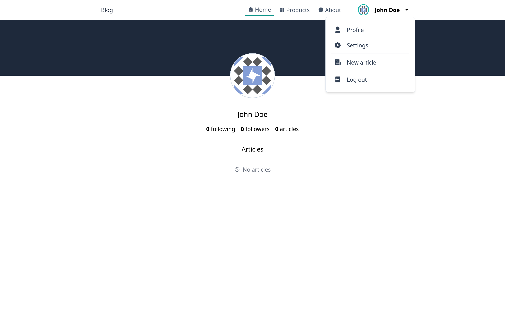|
|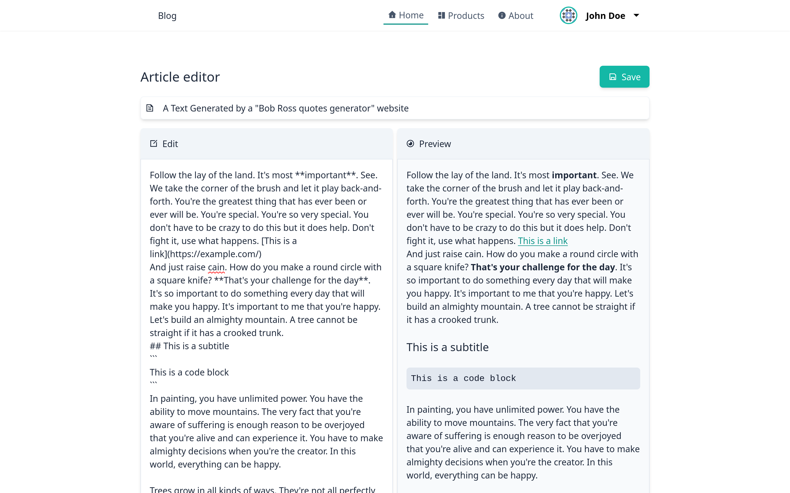|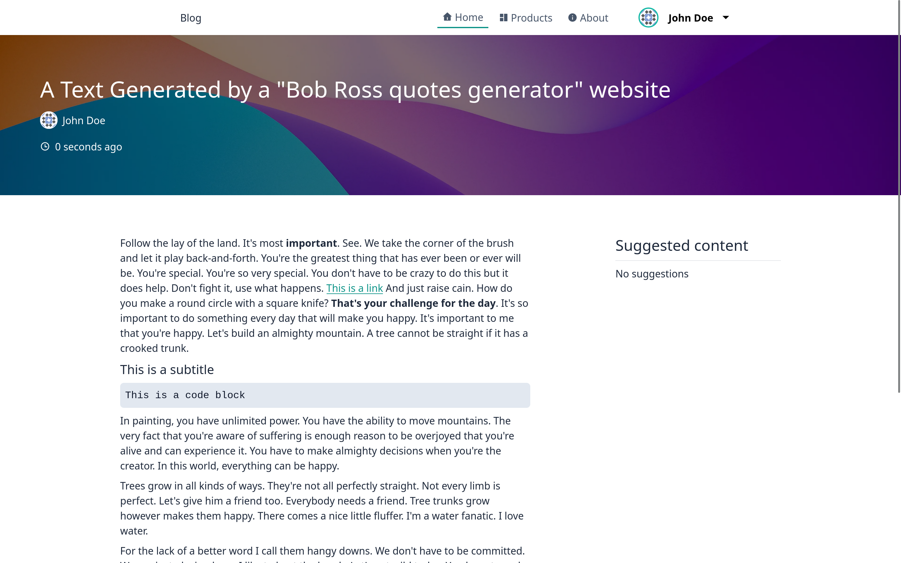|
|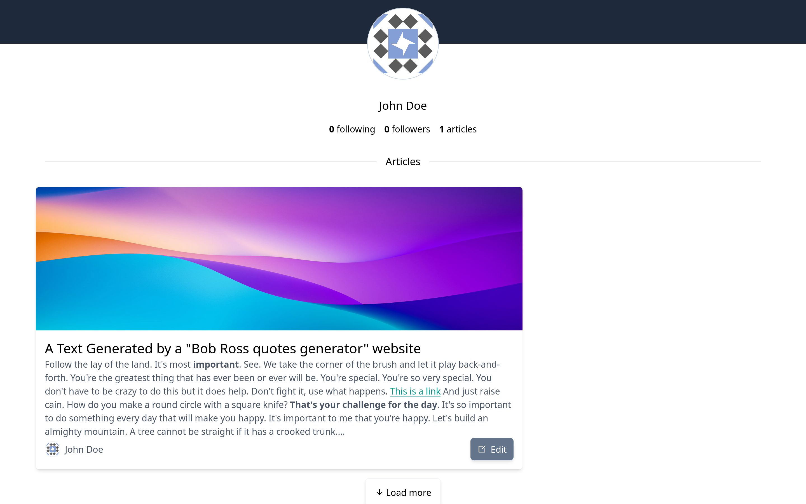||

#### Mobile
|||
|---|---|
|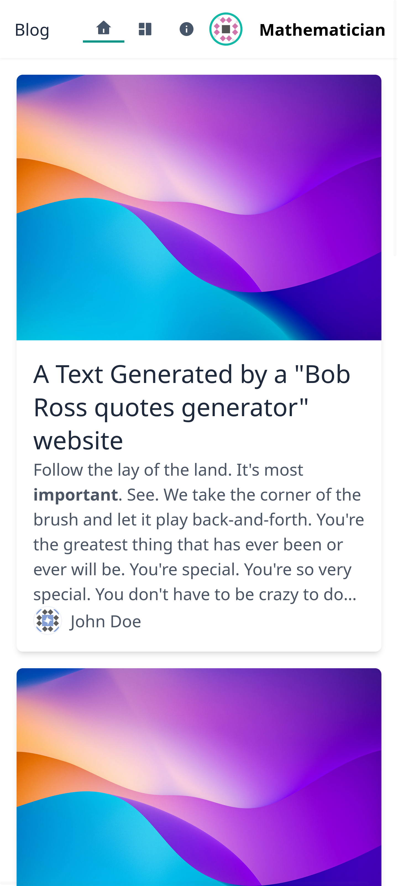||
|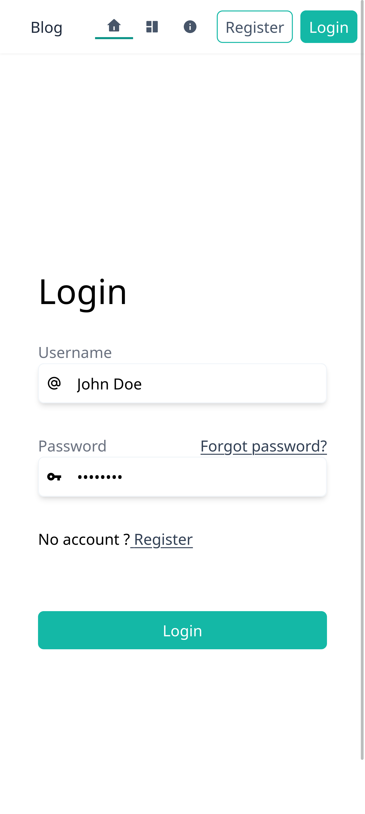|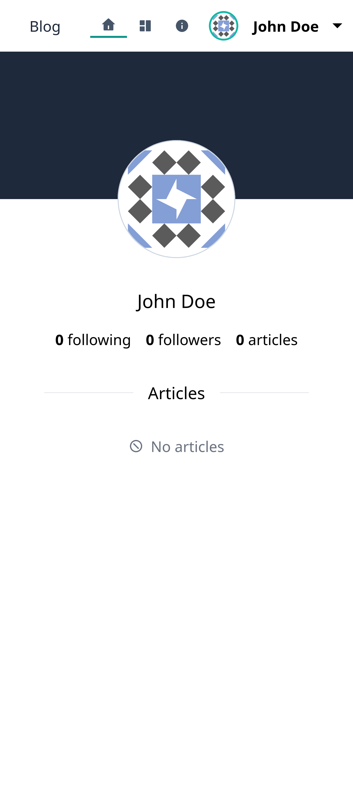|
|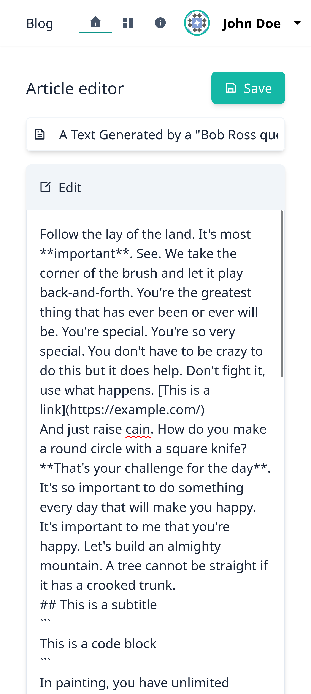|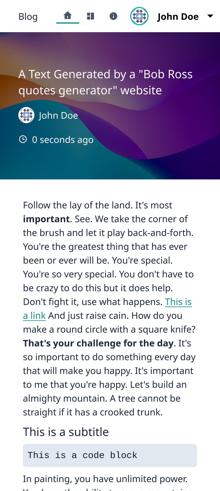|
|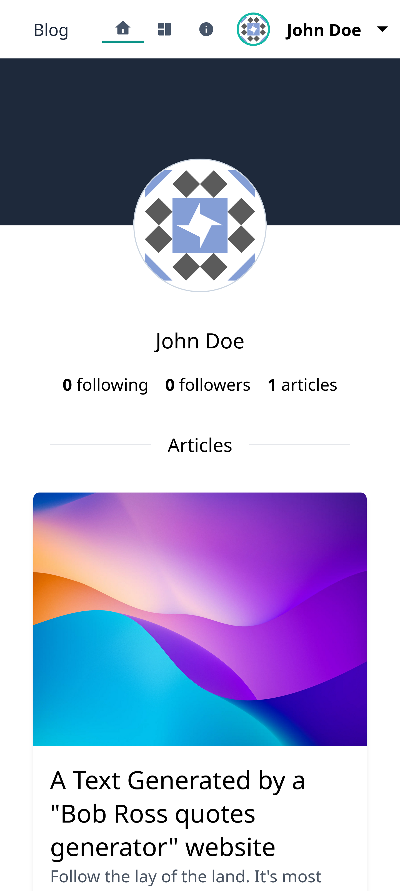||
### Grafana dashboard
|||
|---|---|
|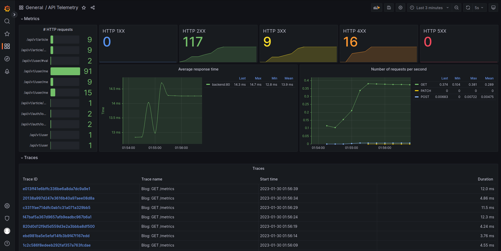|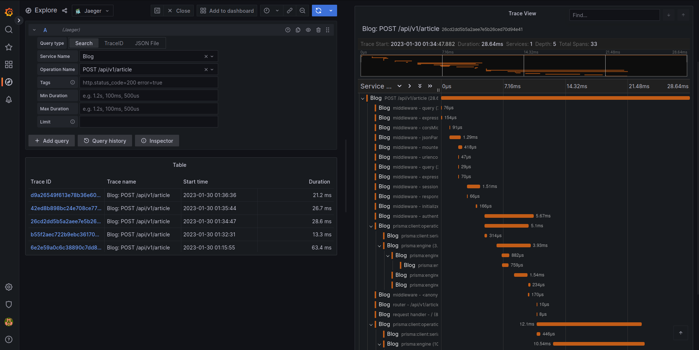|

# To do
## General
- [ ] Add profile pictures
- [ ] Add article thumbnails
- [ ] Add article tags
- [ ] Build a recommendation system
- [ ] Add article statistics
- [ ] Add follows
- [ ] Add a notification system
- [ ] Deploy to kubernetes

## Front-end
### Features to add
- [ ] Add dark mode
- [ ] Add UI for article deletion
- [ ] Show a proper error when trying to edit articles with no access to
- [ ] Add a settings page

### Bugs to fix
- [x] ArticleEditor preview expands with no line warp
- [x] Article view expands with no line warp
- [ ] Ambiguous or non-existant error messages in some places

## Back-end
### Features to add
- [ ] Add pagination
- [ ] Add OpenTelemetry tracing
- [ ] Add swagger documentation

### Bugs to fix
- No bugs discovered yet
